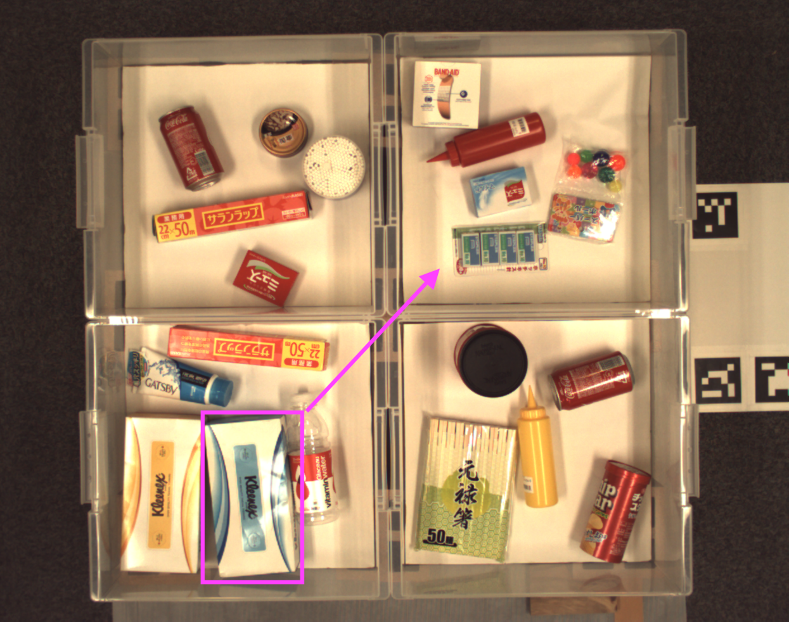

# PFN Picking Instructions for Commodities Dataset (PFN-PIC)
This dataset is a collection of spoken language instructions for a robotic system to pick and place common objects. Text instructions and corresponding object images are provided.

[Download (dataset-main.zip)](https://preferredjp.box.com/v/pfn-pic-dataset-main)

We consider a situation where the robot is instructed by the operator to pick up a specific object and move it to another location: for example, _Move the blue and white tissue box to the top right bin_.



This dataset consists of RGBD images, bounding box annotations, destination box annotations, and text instructions.

```
dataset
├── en.train.jsonl
├── en.validation.jsonl
├── ja.train.jsonl
├── ja.validation.jsonl
├── image_file/
    ├── 1.png
    ├── 2.png
    ├── ....
    └── 1180.png
```

All objects in each image are annotated with bounding boxes.
Each bounding box is associated with a destination box and text instructions.
In addition to RGB images, depth images are also available in [PCD (Point Cloud Data) file format](http://pointclouds.org/documentation/tutorials/pcd_file_format.php).  Since the PCD files are relatively large (17GB), we provide them upon request.  Please create a [GitHub issue](https://github.com/pfnet-research/picking-instruction/issues) for the request.

The bounding box annotations, destination box annotations, and text instructions are provided in `en.train.jsonl`, `en.validation.jsonl`, `ja.train.jsonl`, `ja.validation.jsonl` which are all in
[JSON Lines text file format](http://jsonlines.org/).
Each line of these files represents the annotations for one image.  We recommend to use [jq](https://stedolan.github.io/jq/) or other JSON tools for pretty-printing.

```
$ jq -r '.' dataset/en.train.jsonl | head -30
{
  "image_file": "1.png",
  "pcd_file": "1.pcd",
  "objects": [
    {
      "dest_box": "tl",
      "bbox": {
        "x": 649.7302,
        "y": 654.038,
        "width": 171.1864,
        "height": 235.914
      },
      "instructions": [
        "Put the green package next to the mustard in the first box on the left with the white circle.",
        "pick up the green sachet and put it in the upper left box",
        "Move the green and white package with asian scripture to the top left box."
      ]
    },
...
```

## Citation:
* [English] Jun Hator, Yuta Kikuchi, Sosuke Kobayashi, Kuniyuki Takahashi, Yuta Tsuboi, Yuya Unno, Wilson Ko, Jethro Tan. 
Interactively Picking Real-World Objects with Unconstrained Spoken Language Instructions, 
_Proceedings of International Conference on Robotics and Automation ([ICRA2018](https://icra2018.org/))_, 2018.
[paper content on arxiv](https://arxiv.org/abs/1710.06280) 
(The first 6 authors are contributed equally and ordered alphabetically.)
* [Japanese] 羽鳥 潤, 菊池 悠太, 小林 颯介, 高橋 城志, 坪井 祐太, 海野 裕也, Wilson Ko, Jethro Tan. 実世界におけるインタラクティブな物体指示, _言語処理学会第21回年次大会([NLP2018](http://www.anlp.jp/nlp2018/))_, 2018.
(最初の6人は全員筆頭著者であり貢献度に差はない)

## Statistics
| file name | #image | #bounding box | #instruction|
|:---|---:|---:|---:|
|en.train.json| 1060 | 25500 | 71701|
|en.validation.json| 20 | 353| 898 |
|ja.train.json| 1060 | 25500 | 76551 |
|ja.validation.json| 20 | 383 | 1149 |

Note that since some of the annotations include misspelling and do not appropriately specify target objects in the English validation set, we manually reviewed all the text instructions in the validation set and removed inappropriate instructions.

## 

## Terms of Use
The images and annotations in this dataset belong to Preferred Networks, Inc. and 
are licensed under a [Creative Commons Attribution 4.0 License](https://creativecommons.org/licenses/by/4.0/legalcode).


THIS IMAGES AND ANNOTATIONS ARE PROVIDED "AS IS" AND NO REPRESENTATIONS OR WARRANTIES OF ANY KIND CONCERNING THE IMAGES AND ANNOTATIONS, WHETHER EXPRESS, IMPLIED, STATUTORY, OR OTHER, ARE MADE. THIS INCLUDES, WITHOUT LIMITATION, WARRANTIES OF TITLE, MERCHANTABILITY, FITNESS FOR A PARTICULAR PURPOSE, NON-INFRINGEMENT, ABSENCE OF LATENT OR OTHER DEFECTS, ACCURACY, OR THE PRESENCE OR ABSENCE OF ERRORS, WHETHER OR NOT KNOWN OR DISCOVERABLE. 
IN NO EVENT SHALL THE COPYRIGHT HOLDER BE LIABLE ON ANY THEORY OR OTHERWISE FOR ANY DIRECT, INDIRECT, INCIDENTAL, SPECIAL, CONSEQUENTIAL, PUNITIVE, EXEMPLARY, OR OTHER LOSSES, COSTS, EXPENSES, OR DAMAGES (INCLUDING, BUT NOT LIMITED TO, PROCUREMENT OF SUBSTITUTE GOODS OR SERVICES; LOSS OF USE, DATA, OR PROFITS; OR BUSINESS INTERRUPTION) ARISING OUT OF THIS PUBLIC LICENSE OR USE OF THE IMAGES AND ANNOTATIONS EVEN IF THE COPYRIGHT HOLDER HAS BEEN ADVISED OF THE POSSIBILITY OF SUCH LOSSES, COSTS, EXPENSES, OR DAMAGES.

